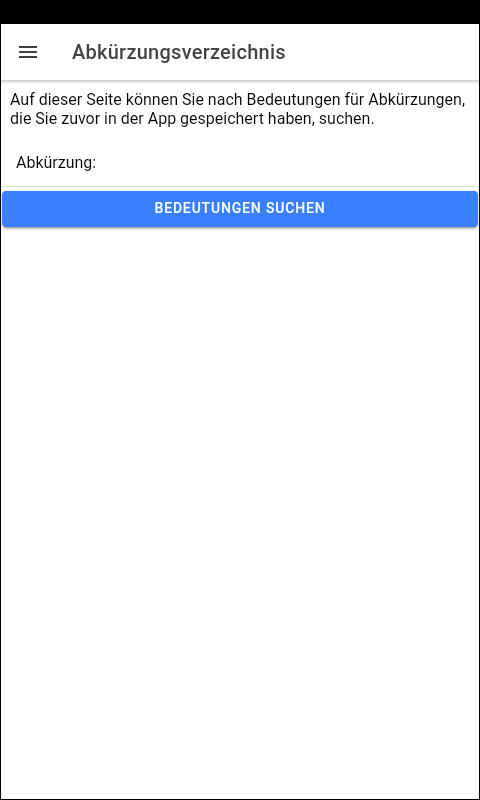
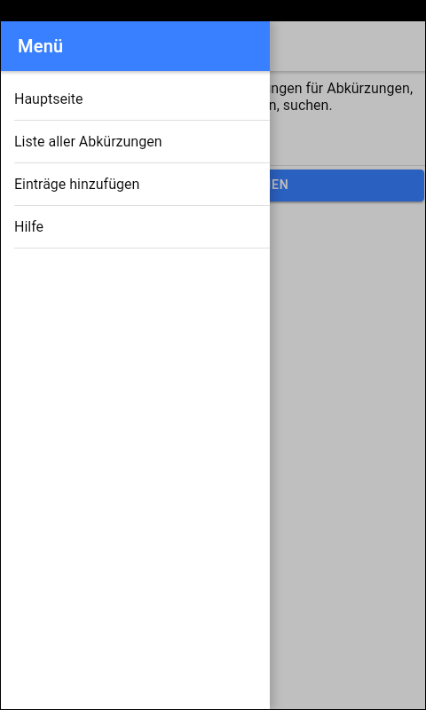
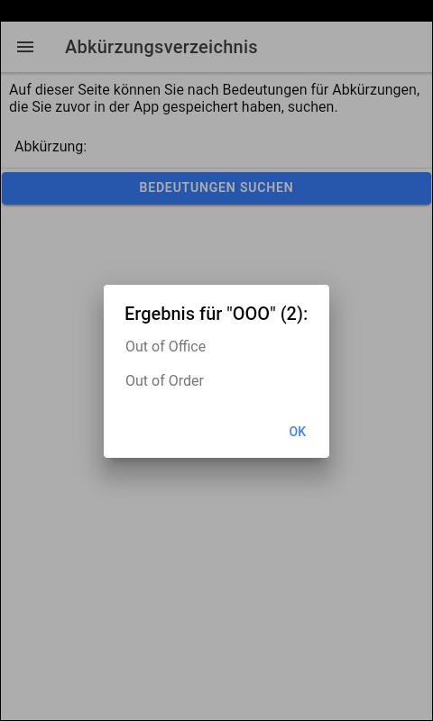
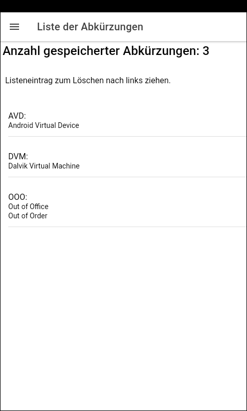
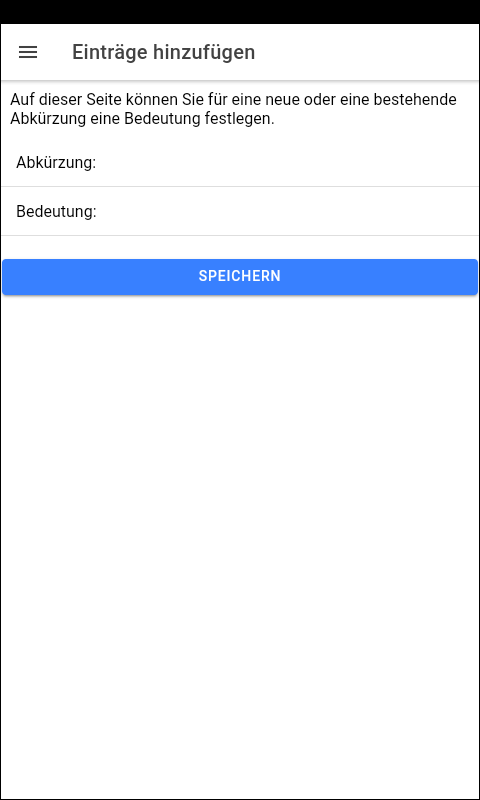

# Ionic-App "AbkVerz" (Abkürzungs-Verzeichnis) #

Simple [Ionic](https://ionicframework.com) app to demonstrate storing data
with [Ionic Storage](https://ionicframework.com/docs/angular/storage#ionic-storage).

 

----

## Screenshots ##

  

  

 

----

## Run the app locally ##

 

**Prerequisite**

NPM package [`@ionic/cli`](https://www.npmjs.com/package/@ionic/cli) must be installed globally:, `npm install -g @ionic/cli`

 

**Steps:**

1. Clone the repository.

2. Open shell in root folder of cloned repository and execute `npm install`.

3. To run app locally in browser execute either `ionic serve` or `ionic serve --lab` .

 

----
## License ##

See the [LICENSE file](LICENSE.md) for license rights and limitations (BSD 3-Clause License) for the files in this repository.
